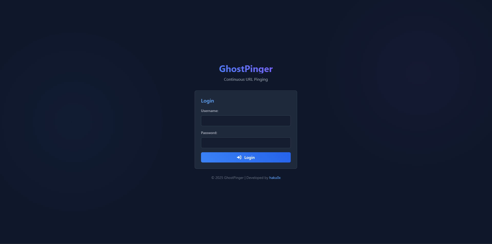
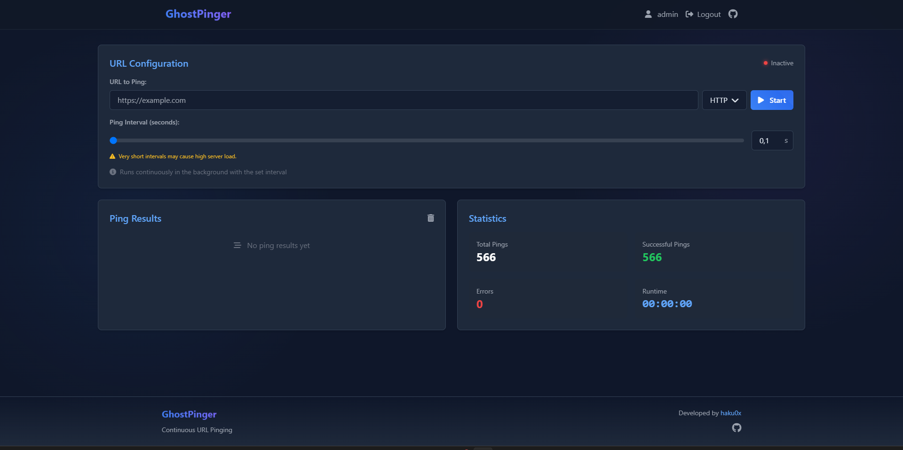

# GhostPinger

**GhostPinger** is a secure, web-based application for continuous URL monitoring using various ping methods. The application provides real-time statistics and logging to help monitor the availability of your websites and services.

## Features

- **Multiple Ping Methods**: Choose between Socket (TCP), HTTP (cURL), and ICMP (system ping)
- **Adjustable Ping Interval**: Set intervals from 0.1 to 10 seconds
- **Real-time Statistics**: Monitor total pings, successful connections, and errors
- **Runtime Counter**: Track how long the current ping session has been active
- **Persistent Settings**: Your configuration is saved between sessions
- **Secure Authentication**: Single administrator account with secure password storage
- **User-Friendly Interface**: Responsive design for use on desktop and mobile devices

## Preview

### Login Page


### Dashboard


## Installation

### 1. Server Requirements

- PHP 7.4 or higher
- Web server (Apache, Nginx, etc.)
- PHP cURL extension (for HTTP methods)
- PHP `exec()` function enabled (for ICMP methods)
- SSL/TLS certificate for HTTPS (Let's Encrypt, self-signed, or commercial)

### 2. Setup

1. **Download the code:**
   Download the repository or clone it using Git:

   ```bash
   git clone https://github.com/haku0x/GhostPinger.git
   cd GhostPinger
   ```

2. **Create a secure directory:**
   Set up a secure directory for storing user data:

   ```bash
   mkdir -p /path/to/private
   chmod 700 /path/to/private
   ```

3. **Edit the configuration file:**
   Modify the `config.php` file to match your needs.

4. **Configure the web server:**
   If you are using Nginx with HTTPS, add the following server block configuration:

   ```nginx
   server {
       listen 443 ssl;
       server_name your-domain.com;
       root /path/to/GhostPinger;
       index index.php;
       ssl_certificate /etc/letsencrypt/live/your-domain.com/fullchain.pem;
       ssl_certificate_key /etc/letsencrypt/live/your-domain.com/privkey.pem;
       ssl_protocols TLSv1.2 TLSv1.3;
       ssl_ciphers HIGH:!aNULL:!MD5;

       location / {
           try_files $uri $uri/ /index.php?$query_string;
       }

       location ~ \.php$ {
           include fastcgi_params;
           fastcgi_pass unix:/run/php/php7.4-fpm.sock;
           fastcgi_index index.php;
           fastcgi_param SCRIPT_FILENAME $document_root$fastcgi_script_name;
       }
   }
   ```

   Redirect HTTP to HTTPS:

   ```nginx
   server {
       listen 80;
       server_name your-domain.com;
       return 301 https://$host$request_uri;
   }
   ```

   For Apache, ensure that the `mod_rewrite` and `mod_ssl` modules are enabled and add:

   ```apache
   <VirtualHost *:80>
       ServerName your-domain.com
       Redirect permanent / https://your-domain.com/
   </VirtualHost>

   <VirtualHost *:443>
       ServerName your-domain.com
       DocumentRoot /path/to/GhostPinger
       SSLEngine on
       SSLCertificateFile /etc/letsencrypt/live/your-domain.com/fullchain.pem
       SSLCertificateKeyFile /etc/letsencrypt/live/your-domain.com/privkey.pem
   </VirtualHost>
   ```

5. **Set permissions:**

   ```bash
   chmod -R 755 /path/to/GhostPinger
   chown -R www-data:www-data /path/to/GhostPinger
   ```

6. **Start the application:**
   Open `https://your-domain.com` in your browser and follow the instructions for the initial setup.

## Security Recommendations

- Ensure that the admin password is strong.
- Prevent public access to sensitive configuration files.
- Set strict file permissions to avoid unauthorized access.
- Use an SSL certificate to encrypt communication.
- Enable automatic SSL renewal (if using Let's Encrypt):
  ```bash
  certbot renew --dry-run
  ```

## Support & Development

If you have any questions, want to contribute to the development, or need support, join our Discord server: [https://discord.gg/MHW6QnBHDY](https://discord.gg/MHW6QnBHDY)
